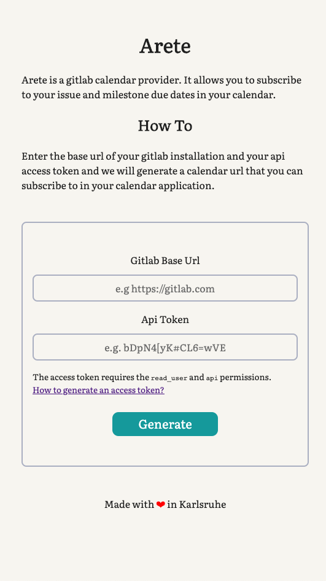

# Arete

Arete is a calender provider for your gitlab instance. It allows
you to see the milestone and issue due dates of all your projects
in your calender.

## Dependencies

- Ruby (MRI) 2.6.1

Other ruby versions should work as well, but I developed it with Ruby (MRI) 2.6.1.

## Setup

Setup is easy as pie.

Install the dependencies:

```bash
$ bundle install
```

Start the server

```bash
$ bundle exec rackup
```

Open your favorite browser and go to `http://localhost:9292`. You can then
enter the url of your gitlab installation and your api token to generate
your personal calendar url.

## Screenshots



## License

This project is licensed under the terms and conditions of the MIT license.
See the `LICENSE` file for the details of the license.
